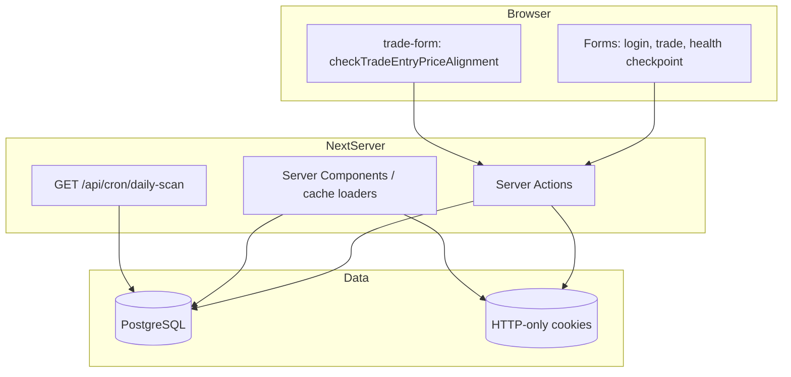

# Frontend Integration Map

Maps **pages/components → data source → mutations**. All paths TRACED unless noted.

---

## Auth shell

| UI | Read | Write |
|----|------|-------|
| `(dashboard)/layout.tsx` | `getSession()` | — |
| Redirect if absent | → `/login` | |
| `LogoutButton` | — | `logout()` |

---

## `/dashboard`

**File:** `src/app/(dashboard)/dashboard/page.tsx`

| Section | Data source | Module / table |
|---------|-------------|----------------|
| Today's Action | `latestScan.notes.decision` OR `computeDailyTradingDecision` + `getMarketRegimeFromDb` | `setups-queries`, `trading-decision`, `get-market-regime` |
| Best Setups (top 5) | `getLatestDailyScanRun` → `prepareSurfacedCandidatesHealthView` | `setup_candidates`, `setup_watch_items`, bars |
| Momentum Watch | `<MomentumWatchSection />` | `momentum-watch.ts` |
| Exposure | `prisma.trade` (user trades, OPEN) + `isTradingRiskBudgetConfigured()` | `trades`, env |
| Watchlist | `prisma.setupWatchItem` + latest `stockDailyBar` closes | watch + bars |
| Diagnostics | `parseDailyScanGate2Notes(latestScan.notes)` | `daily_scan_runs.notes` |
| Alignment banner | `fetchMarketSessionSnapshot` + `analyzeMarketDataAlignment` | index + equity max + scan run |

**Mutations:** Link only → `/trades/new` (no inline forms).

**Client components:** None on page (server-only).

---

## `/setups`

**File:** `src/app/(dashboard)/setups/page.tsx` — Suspense segments.

| Segment | Component | Cached loader |
|---------|-----------|---------------|
| Overview | `SetupsOverviewAsync` | `loadSetupsBaseData`, `loadGate2BreakdownCached` |
| Candidates | `SetupsCandidatesAsync` | `loadSurfacedCandidatesHealthCached`, `loadSetupPerfRowsCached` |
| Momentum | `MomentumWatchSection` | `getMomentumWatchRowsForPhase1` |
| Tail | `SetupsTailAsync` | `loadSetupsBaseData` (closest symbols, tradability breakdown) |

**Base loader** (`setups-cached-data.ts`):

- `getLatestDailyScanRun()`
- `getExpectedLatestSessionFromIndexBars`
- `prisma.stockDailyBar.aggregate(_max.date)`

**Mutations:** Link `href={/trades/new?setupCandidateId=${c.id}}` in `setups-candidates-async.tsx`.

**Fallbacks:** `setups-stream-fallbacks.tsx` — skeleton only.

---

## `/trades`

**File:** `src/app/(dashboard)/trades/page.tsx` (`dynamic = "force-dynamic"`)

| Feature | Data |
|---------|------|
| Trade list | `prisma.trade.findMany` + `setupCandidate` select |
| Filters | URL `searchParams` (client `TradeFilters` + `useSearchParams`) |
| Open marks | `loadOpenPositionMarks`, `fetchLatestTwoClosesByTradeSymbols`, baseline bars |
| Health checkpoints | Raw SQL `trade_health_logs` (today, latest, weekly agg) |
| Review UX | Pure functions in `src/lib/trades/*` (no extra API) |
| Operating snapshot | Read cookie → compare → `OperatingSnapshotPersist` → `persistBookOperatingSnapshot` |
| Alignment | `fetchMarketSessionSnapshot` |

**Client components:**

- `trade-filters.tsx`
- `open-position-review-cell.tsx`
- `focus-review-workspace.tsx`
- `review-session-chrome.tsx`
- `operating-snapshot-persist.tsx`

**Mutations:** None on list page (navigation to detail/new only).

---

## `/trades/new`

**File:** `src/app/(dashboard)/trades/new/page.tsx`

| Query param | Behavior |
|-------------|----------|
| `setupCandidateId` | Loads `setupCandidate` + `setupWatchItem` → `TradeForm` `initialValues` |

**Mutation:** `createTrade` via `TradeForm`.

---

## `/trades/[id]`

**File:** `src/app/(dashboard)/trades/[id]/page.tsx`

| Block | Data |
|-------|------|
| Trade form | `prisma.trade.findFirst` + setup relations |
| Open metrics | `loadOpenPositionMarks`, `computeOpenPhase2Metrics` |
| Health history | Raw SQL `trade_health_logs` |
| Checkpoint form | `addTradeHealthCheckpoint` |
| Delete | `DeleteTradeButton` → `deleteTrade` |

**Mutation:** `updateTrade`, `addTradeHealthCheckpoint`, `deleteTrade`.

---

## Shared components

| Component | Integration |
|-----------|-------------|
| `trade-form.tsx` | `useActionState` + `createTrade`/`updateTrade`; client calls `checkTradeEntryPriceAlignment` |
| `market-data-alignment-banner.tsx` | Props from `analyzeMarketDataAlignment` |
| `setups-candidate-position-sizing.tsx` | **INFERRED:** uses env/risk helpers — read component for sizing math |
| `dashboard-kpi-band.tsx` | **grep:** verify usage — may be unused |

---

## `/login`, `/register`, `/`

Standard auth forms → `login`/`register`. Home page static links.

---

## Data flow diagram (simplified)

---

## What the frontend does NOT call

**TRACED:** No page calls `/api/db-health` or `/api/cron/daily-scan`.

**TRACED:** No REST JSON resource for trades, setups, or scans.

---

## Dead / planned UI (not in integration map)

| Asset | Status |
|-------|--------|
| `EquityPanel` / `EquityCurveChart` | Not mounted |
| `analytics.ts` helpers | Not mounted |
| `UI_BLUEPRINT.md` KPI band (archived, see `docs/archive/UI_BLUEPRINT.md`) | Aspirational |

Rebuild should not assume these exist in runtime without new wiring.
