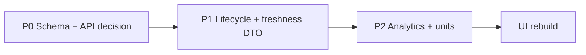

# Backend Gaps Before Clean UI Rebuild

Ordered by dependency. Items are **TRACED** from code/docs unless marked **NEEDS_BACKEND_CONFIRMATION**.

---

## P0 — Contract and schema integrity

### 1. Promote `trade_health_logs` to first-class Prisma model

**Why:** Entire open-position review UX depends on raw SQL (`trades/page.tsx`, `trades/[id]/page.tsx`, `addTradeHealthCheckpoint`).

**Done when:**

- Model + typed queries exist
- Migrations remain compatible
- Failed reads return explicit errors to UI (not empty history)

**Evidence:** `prisma/migrations/20260506120000_trade_health_logs/migration.sql` vs missing `schema.prisma` entry.

---

### 2. Decide and document public API surface

**Options (NEEDS_BACKEND_CONFIRMATION):**

- **A.** Keep Server Actions + RSC only (document as canonical)
- **B.** Add versioned REST/JSON routes mirroring trade/setup/scan reads

**Why:** Rebuild teams often assume REST; current repo has none for product data.

---

### 3. Fix `SetupOutcome.healthLevelAtExit` on close

**Why:** `writeSetupOutcomeFromTrade` copies `healthLevelAtEntry` (`trades.ts`).

**Done when:** Exit health captured from last checkpoint or explicit form field.

---

## P1 — Data truth the UI already advertises

### 4. Unified setup lifecycle API

**Why:** DB `SetupLifecycleStatus` vs computed `lifecycleSortLabel` diverge (`05-integration-mismatches.md` §3).

**Done when:** Single server DTO field drives Dashboard + Setups + Watchlist.

---

### 5. Explicit market-data freshness DTO

**Why:** `fetchMarketSessionSnapshot` + alignment banners are computed in multiple pages.

**Done when:** One loader returns `{ benchmarkDate, equityMaxDate, scanRunAt, delayedBackdrop, staleFlags[] }` consumed everywhere.

**Evidence:** `market-session-snapshot.ts`, `market-data-alignment.ts`.

---

### 6. Risk budget backend (optional product)

**Why:** `TRADING_ACCOUNT_EQUITY_VND` only toggles copy; no server-side capacity math.

**Done when (if required):** API returns `equityVnd`, `openRiskVnd`, `guidedMaxVnd`, `perTradeCapVnd` from env + open trades.

**Evidence:** `trading-account-risk-config.ts`, dashboard exposure section.

---

### 7. Timezone contract for “reviewed today”

**Why:** Server local midnight vs UTC ambiguity (`trade-page-position-health-frd.md`).

**Done when:** API returns `reviewDayKey` or TZ-aware booleans.

---

## P2 — Completeness for planned UX

### 8. Performance analytics read path

**Why:** `analytics.ts` + `EquityPanel` exist but no page wires them.

**Done when:** Endpoint or RSC loader returns `AdvancedMetrics`, `EquityDataPoint[]`, `PlaybookPerformance[]` from `Trade[]`.

---

### 9. Momentum watch DTO with unit metadata

**Why:** `latestClose.toFixed(2)` without thousand-đồng labeling (`momentum-watch-section.tsx`).

**Done when:** Same `formatEquityThousandVndPerShare` contract as setups or explicit `priceUnit: "thousand_vnd"`.

---

### 10. Setup candidate → trade deep link contract

**TRACED today:** `GET /trades/new?setupCandidateId=` loads candidate + watch health.

**Gap:** No validation that candidate belongs to **latest** scan run — stale candidate IDs still prefill.

**NEEDS_BACKEND_CONFIRMATION:** Should old candidates be rejected?

---

### 11. Tactical universe documentation vs implementation

**Why:** Schema comment says dormant; scanner merges tactical symbols.

**Done when:** Ops runbook and schema comment match `computeEffectiveScanUniverse` behavior.

---

## P3 — Operations (not UI-blocking but integration)

### 12. Cron observability contract

**TRACED:** Cron returns spread `summaryJson` keys.

**Gap:** No persisted “last cron status” row for UI — setups page only sees latest `DailyScanRun`.

**Done when (if UI needs ops health):** `DailyScanRun.status=FAILED` surfaced with actionable `errorSummary` in Setups empty state (partially exists).

---

### 13. Bar import pipeline health in-app

**Why:** Empty states point to CLI (`npx tsx scripts/run-daily-scanner.ts`) — no in-app import status API.

**UNKNOWN:** Whether UI should trigger imports (product decision).

---

## Non-gaps (do not rebuild as missing backend)

| Capability | Status |
|------------|--------|
| User auth (email/password) | Working via Prisma + session cookie |
| Trade CRUD | Working via Server Actions |
| Daily scanner persistence | Working via cron + `runDailyScanJob` |
| Gate2 candidate surfacing | Working when bars present |
| Health checkpoint insert | Working when table exists |

---

## Suggested rebuild sequence

---

## Verification checklist (no code changes in this audit)

Before marking UI stories “done”, require:

- [ ] Trace from UI field → Prisma model or documented Server Action
- [ ] No empty state without `error`/`reason` when DB query failed
- [ ] Price fields show unit (thousand VND) consistently
- [ ] Lifecycle/status labels map to one backend enum path
- [ ] Health review features fail loudly if `trade_health_logs` missing
