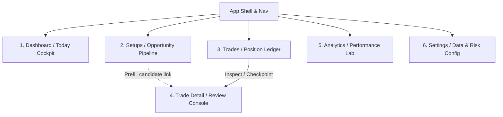

# UI/UX Mockup & Rebuild Blueprint

This document defines the frontend rebuild blueprint and visual mockup specification for the trading intelligence application. It enforces strict alignment with the verified API and data layer truth documented in [docs/integration/](./), mapping every visual element to a verified database model or Server Action, and explicitly marking backend-blocked elements as `BACKEND_BLOCKED`.

---

## Section 1 — Current Page Inventory

The following table inventories the existing app routes based on a full repository scan.

| Route | Current Purpose | Data Source | Keep/Rebuild/Merge/Remove | Reason |
|---|---|---|---|---|
| `/` | Marketing landing page with login/register links. | Static server-side file rendering | `KEEP` | Keep as simple entry gate. Needs styling alignment. |
| `/login` | Authentication entry. | Server Action `login` (`auth.ts`), Zod validation | `KEEP` | Core authentication layer works; only requires design system styling polish. |
| `/register` | User onboarding. | Server Action `register` (`auth.ts`), Zod validation | `KEEP` | Works as intended; requires design system styling polish. |
| `/dashboard` | Core landing cockpit for traders. | `getMarketRegimeFromDb`, `getLatestDailyScanRun`, candidates, watchlist, exposure | `REBUILD` | Dashboard handles error states silently via empty lists. Needs explicit data freshness alerts and proper loading skeletons. |
| `/setups` | Opportunity scan display and details. | `getLatestDailyScanRun`, surfaced candidates, performance tables, closest symbols | `REBUILD` | Split views using suspense boundaries, but merges computed and DB statuses. Needs to unify setup lifecycles. |
| `/trades` | Dense position ledger, review queues, and clusters. | `prisma.trade`, raw SQL health logs, open position marks, cookies | `REBUILD` | The route file is a monolithic 1959-line file. Needs refactoring into modular components with explicit timezone and data freshness states. |
| `/trades/new` | Log new trade form page. | `prisma.setupCandidate` lookup by URL param, prefill fields | `REBUILD` | Does not validate if the setup candidate is stale (from an old scan run). Needs validation gates. |
| `/trades/[id]` | Edit trade details, health history, and outcomes. | `prisma.trade`, raw SQL health logs, outcomes | `REBUILD` | Relies on raw SQL query bypasses for `trade_health_logs`. Needs promotion to Prisma model and clear error state feedback. |

---

## Section 2 — Recommended Information Architecture

The proposed future page structure organizes the application around a premium trading cockpit design, while maintaining strict data contract validation.



### 1. Dashboard / Today Command Center
* **User Goal:** Quickly assess if market data is reliable, determine today's trading stance (Stance/Allocation), scan the top 5 setups, and check open position risk exposure.
* **Primary Data Needed:** Market regime level (Gate 1), latest scan run summary, top 5 surfaced candidates with health flags, open position count, and total entry notional exposure.
* **Backend/RSC/Server Action Dependency:** `getMarketRegimeFromDb`, `getLatestDailyScanRun`, `prepareSurfacedCandidatesHealthView`, and `prisma.trade.findMany` (OPEN status).
* **Current Blocker:** None for baseline data. However, showing real remaining risk budget is blocked by the lack of account equity state in the database (env only).
* **Priority:** **P0**

### 2. Setups / Opportunity Pipeline
* **User Goal:** Track all candidates from the latest scan run, check pullback zone distances, examine detailed scanner reasons, and view historical playbook performance.
* **Primary Data Needed:** Full candidate list, pullback zone coordinates, closest-to-valid symbol metrics, and historical setup performance metrics.
* **Backend/RSC/Server Action Dependency:** `toCandidateRows(run)`, `loadSetupPerfRowsCached`, and `loadGate2BreakdownCached`.
* **Current Blocker:** Stale setup validation (P2) is missing; a trader can deep-link into `/trades/new` with a candidate from a scan run completed weeks ago.
* **Priority:** **P1**

### 3. Trades / Position Management
* **User Goal:** Review open positions, track eod review queues sorted by priority (stops violated, structure weakened, stale data), and update operating trend discipline postures.
* **Primary Data Needed:** Trades ledger (status-filtered), latest health logs per trade, prior closes, and operating posture states.
* **Backend/RSC/Server Action Dependency:** `prisma.trade.findMany`, raw SQL `trade_health_logs` aggregate queries, `loadOpenPositionMarks`, and cookie snapshots.
* **Current Blocker:** `trade_health_logs` is not in the Prisma client, risking schema drifts and silent query failures (P0).
* **Priority:** **P0**

### 4. Trade Detail / Review Console
* **User Goal:** View detailed parameters of a trade, log EOD health checkpoints (health level, checklists, recommended actions), and write outcomes back to setup logs on exit.
* **Primary Data Needed:** Single trade record, full historical timeline of health checkpoints, and live unrealized P&L calculations.
* **Backend/RSC/Server Action Dependency:** `prisma.trade.findFirst`, `addTradeHealthCheckpoint`, raw SQL health log inserts/selects, and `writeSetupOutcomeFromTrade`.
* **Current Blocker:** `SetupOutcome.healthLevelAtExit` incorrectly clones entry health rather than exit health on close (P0).
* **Priority:** **P0**

### 5. Analytics / Performance Lab
* **User Goal:** Study equity curve evolution, track drawdown characteristics, identify recurring mistake patterns, and compare playbook efficiencies.
* **Primary Data Needed:** Cumulative P&L timeline, max drawdowns, count of mistake tags, and win-rate ratios by setup tier.
* **Backend/RSC/Server Action Dependency:** `loadAdvancedMetrics` / `EquityPanel` (currently unwired in code).
* **Current Blocker:** **BACKEND_BLOCKED** (P2 Gap: `analytics.ts` has no database read path wired to any page).
* **Priority:** **P2**

### 6. Settings / Data & Risk Configuration
* **User Goal:** Set account equity values dynamically, customize risk caps (qualitative stance limits), modify active playbook rules, and view Vercel cron scan job logs.
* **Primary Data Needed:** User settings profile, account equity values, timezone configurations, and daily import statuses.
* **Backend/RSC/Server Action Dependency:** **BACKEND_BLOCKED** (P1 Gap: no database model or server endpoints for timezone storage or settings configurations).
* **Current Blocker:** No settings database table exists; configuration is completely env-based or hardcoded.
* **Priority:** **P2**

---

## Section 3 — Low-Fidelity Wireframe Per Page

### 1. Dashboard / Today Command Center
```txt
┌──────────────────────────────────────────────────────────────────────────────┐
│ Top Bar: Logo | Dashboard(Active) | Setups | Trades | Analytics [Log Trade] │
├──────────────────────────────────────────────────────────────────────────────┤
│ ⚠️ Freshness Banner: Market data matches. Index: 2026-05-25 (OK)              │
├──────────────────────────────────────┬───────────────────────────────────────┤
│ TODAY'S ACTION COCKPIT               │ PORTFOLIO RISK & EXPOSURE             │
│ Stance: PROBE (Qualitative Stance)   │ Active Positions: 3                   │
│ Max Allocation: 20-40%               │ Entry Exposure: 180,000k ₫            │
│ Backdrop: PASS (VNINDEX)             │ Risk Budget: [BACKEND_BLOCKED]        │
├──────────────────────────────────────┴───────────────────────────────────────┤
│ BEST SETUPS (TOP 5) - CURRENT RUN                                            │
│ AAA [READY]   Healthy (92)  Close: 42.50 Zone: 41.0-42.5  Stop: 39.50         │
│ BBB [WATCHING] Warning (68)  Close: 110.0 Zone: 95.0-105.0 Stop: 90.00         │
├──────────────────────────────────────────────────────────────────────────────┤
│ ACTIVE WATCHLIST                                                             │
│ CCC [WATCH]   Healthy (88)  Zone: 22.0-23.5  Dist: +1.2%  Hint: Wait for PB  │
│ DDD [WATCH]   At Risk (48)  Zone: 54.0-56.0  Dist: -2.3%  Hint: Avoid entry  │
├──────────────────────────────────────────────────────────────────────────────┤
│ SCAN DIAGNOSTICS (REJECTIONS)                                                │
│ ▸ Price Above Zone (14) - Wait for pullback to entry trigger.                │
│ ▸ Low Liquidity    (8)  - Universe filter; scan omitted.                     │
└──────────────────────────────────────────────────────────────────────────────┘
```

### 2. Setups / Opportunity Pipeline
```txt
┌──────────────────────────────────────────────────────────────────────────────┐
│ Page Title: Setups Opportunity Pipeline                                      │
├──────────────────────────────────────────────────────────────────────────────┤
│ 💡 SCAN RUN: Completed at 2026-05-25 07:30 UTC | Universe: 382 Scanned        │
├──────────────────────────────────────────────────────────────────────────────┤
│ PIPELINE TABLE (Tier A/B breakout/pullback candidates)                       │
│ Symbol Status    Health       Score      Close   Zone        Stop    Bar Date│
│ AAA    [READY]   HEALTHY      Strong(92) 42.50   41.0-42.5   39.50   05-25   │
│ └─ [▼] Setup details                                                         │
│        Aging breakout pullback; zone holding. Distance: 0.0%                 │
│        [Position Sizing Calculator]                                          │
│        Target Risk: 1% | Recommended Size: 2,500 Shares (106,250k ₫)         │
│        [Create Trade from Setup Candidate ➜]                                 │
│ BBB    [WATCHING] AT_RISK     Weak (48)  48.10   43.0-45.0   41.00   05-25   │
│ └─ [▶] Setup details (Collapsed by default)                                  │
├──────────────────────────────────────┬───────────────────────────────────────┤
│ HISTORICAL PLAYBOOK PERFORMANCES     │ CLOSEST TO SURFACING (NEAR MISSES)    │
│ Playbook       Trades Win%  Avg R    │ Symbol Closes  Gap    Blocking Gap    │
│ Breakout_PB    48     54%   +1.12R   │ EEE    34.20   1.2%   Low breakout vol│
└──────────────────────────────────────┴───────────────────────────────────────┘
```

### 3. Trades / Position Management
```txt
┌──────────────────────────────────────────────────────────────────────────────┐
│ Page Title: Position Review Console                                          │
├──────────────────────────────────────────────────────────────────────────────┤
│ POSTURE: STABILIZING | Urgent Reviews: 1 | High Attention: 2                 │
├──────────────────────────────────────────────────────────────────────────────┤
│ FILTERS: [ Search Symbol ] | Status: [ OPEN ] | Sort: [ Priority (Desc) ]    │
├──────────────────────────────────────────────────────────────────────────────┤
│ 🔴 POSITION REVIEW QUEUE (Sorted by urgency)                                 │
│ Symbol Dir  Status  Post.  Price  Stop   TP     Risk  P&L     Review Action  │
│ AAA    LONG OPEN    DEF    42.50  39.50  48.00  1.0%  +1,200k [Review Now ➜] │
│ └─ Escalation: Stop violation imminent; structure weakening.                 │
│ BBB    LONG OPEN    HOLD   102.1  95.00  115.0  1.2%  -4,500k [Review Now ➜] │
│ └─ Escalation: Stale market data (equity bar date older than index).         │
├──────────────────────────────────────────────────────────────────────────────┤
│ 📁 CLOSED JOURNAL (Scroll-accessible below fold)                             │
│ Symbol Playbook    Direction Entry  Exit    Realized P&L  R-Mult Outcome     │
│ CCC    Breakout_PB LONG      41.20  46.80   +5,600k ₫     +2.10R WIN         │
└──────────────────────────────────────────────────────────────────────────────┘
```

### 4. Trade Detail / Review Console
```txt
┌──────────────────────────────────────────────────────────────────────────────┐
│ Header: Trade Details - Edit Trade [AAA]                     [Delete Trade]  │
│ Info: LONG · OPEN · Breakout Pullback · Held: 4 Days · Setup Tier: A         │
├──────────────────────────────────────────────────────────────────────────────┤
│ 📊 POSITION MARKS (UTC Days)                                                 │
│ Holding: 4 Days   | Entry Price: 41.50   | Latest Close: 42.50 (05-25)       │
│ R Multiple: +0.40R | Dist to Stop: +3.00k | Unrealized: +1,000k ₫ (+2.4%)    │
├──────────────────────────────────────────────────────────────────────────────┤
│ 📝 DAILY HEALTH REVIEW CHECKPOINT (OPEN trades only)                         │
│ [!] Last reviewed: 2026-05-24 16:30 UTC (Not reviewed today)                 │
│ * Health Level: [ Select (Healthy / Warning / At Risk / Dead) ]              │
│ * Health Score: [ 85 ]                                                       │
│ * Review Checklist: [x] Stop Loss Valid  [x] Sizing Valid                    │
│                     [ ] Structure Intact [ ] Exit Plan Mapped                │
│ * Recommended Action: [ Hold position; monitor structure breakout zone. ]    │
│ * Review Outcome: [ Hold - posture discipline ]                              │
│                                                     [Submit Daily Checkpoint]│
├──────────────────────────────────────┬───────────────────────────────────────┤
│ 📅 HEALTH TIMELINE HISTORY           │ ⚙️ CORE POSITION PARAMETERS           │
│ 05-24 16:30: WARNING (Score: 65)     │ Symbol: [ AAA ]  Direction: [ LONG ]  │
│   Structure weak; hold.              │ Status: [ OPEN ] Playbook: Breakout_PB│
│ 05-23 15:20: HEALTHY (Score: 88)     │ Entry Date: 2026-05-21  Exit: [   ]   │
│   Pullback bounce successful.        │ Entry Price: 41.50   Stop: 39.50      │
└──────────────────────────────────────┴───────────────────────────────────────┘
```

### 5. Analytics / Performance Lab
```txt
┌──────────────────────────────────────────────────────────────────────────────┐
│ Page Title: Analytics & Performance Lab                                      │
├──────────────────────────────────────────────────────────────────────────────┤
│ 🛑 STATUS: BACKEND_BLOCKED (Gap 8: No database read path for analytics)       │
├──────────────────────────────────────────────────────────────────────────────┤
│ [PROTOTYPE ONLY - WIREFRAME DEPICTION]                                       │
│                                                                              │
│ ┌ Equity Curve (Cumulative P&L) ────────┐ ┌ Drawdown Profile ──────────────┐ │
│ │                                       │ │                                │ │
│ │   Realized Equity line (₫)            │ │   Max drawdown spikes (%)      │ │
│ │   [Unwired]                           │ │   [Unwired]                    │ │
│ └───────────────────────────────────────┘ └────────────────────────────────┘ │
│ ┌ Playbook Win Ratios ──────────────────┐ ┌ Mistake Pattern Distribution ──┐ │
│ │ Breakout_PB: 54% (Avg +1.1R)          │ │ Chasing breakout: 14 occurrences│ │
│ │ [Unwired]                             │ │ Ignoring Stop:    6 occurrences│ │
│ └───────────────────────────────────────┘ └────────────────────────────────┘ │
└──────────────────────────────────────────────────────────────────────────────┘
```

### 6. Settings / Data & Risk Configuration
```txt
┌──────────────────────────────────────────────────────────────────────────────┐
│ Page Title: Settings & Risk Configuration                                    │
├──────────────────────────────────────────────────────────────────────────────┤
│ 🛑 STATUS: PARTIALLY BACKEND_BLOCKED (Gap 6/7: Timezone and dynamic budget)  │
├──────────────────────────────────────────────────────────────────────────────┤
│ ⚙️ RISK SETTINGS                                                             │
│ Qualitative Stance Limits (Read-only from Server Config):                    │
│ * PROBE: Max 20-40% total portfolio allocation.                             │
│ * NORMAL: Max 40-60% total portfolio allocation.                           │
│                                                                              │
│ Dynamic Risk Parameters [BACKEND_BLOCKED]:                                   │
│ * Account Base Equity: [ 500,000,000 ] VND (Currently Env-only override)     │
│                                                                              │
│ ⚙️ TIMEZONE CONFIGURATION [BACKEND_BLOCKED]:                                 │
│ * Local Trader Timezone: [ Asia/Ho_Chi_Minh (GMT+7) ]                        │
│   (Defaulting to Server local timezone; checked today midnight boundary issues)│
└──────────────────────────────────────────────────────────────────────────────┘
```

---

## Section 4 — High-Fidelity Mockup Specification

### Page: Dashboard
* **Visual Intent:** Command cockpit look. Dark slate background, crisp neon border accents, typography emphasizing numbers. Avoids visual decorations; uses high-contrast labels for critical warning conditions.
* **Layout:** Grid structure matching [UI_BLUEPRINT.md](file:///d:/Tools/Trading/UI_BLUEPRINT.md). Row A: Regime banner. Row B (Split): Left Metrics, Right Watchlist. Row C: Top Setups.
* **Components:** `PageHeader`, `MarketDataAlignmentBanner`, `RegimePanel`, `MetricsCluster`, `SetupsPipelineTable`, `MomentumWatchSection`.
* **Data Contract:**
  | UI Block | Required Field | Source | Available Now? | Backend Gap |
  |---|---|---|---|---|
  | Regime Strip | `level`, `latestBar.close`, `latestBar.date` | `getMarketRegimeFromDb` | Yes | None |
  | Alignment Banner | `showBanner`, `staleFlags[]` | `analyzeMarketDataAlignment` | Yes | None |
  | Metrics (Stance) | `decision.level`, `decision.allocation` | `computeDailyTradingDecision` | Yes | None |
  | Exposure (VND) | `currentExposure` (sum of entry price * qty) | `prisma.trade` (OPEN) | Yes | None |
  | Exposure (Risk %) | `maxPortfolioPct`, remaining budget | `isTradingRiskBudgetConfigured` | **No** (Qualitative only) | Gap 6: Risk budget DB storage |
  | Top 5 Setups | `symbolKey`, `lifecycleSortLabel`, `healthScore` | `prepareSurfacedCandidatesHealthView` | Yes | None |
  | Watchlist | `lifecycleStatus`, `healthLevel`, `distToZone` | `prisma.setupWatchItem` | Yes | None |
* **States:**
  * *Loading:* Page-level pulse skeleton loading (`LoadingSkeleton`).
  * *Empty:* Custom fallback texts per card segment (e.g. "No watchlist items active").
  * *Error:* Loud error banners containing database retry controls if the prisma query fails.
  * *Stale data:* Alignment banner visible with warning status if VNINDEX/equity bars are out of sync.
  * *Success:* Standard view with green/yellow indicators.
  * *Disabled:* Forms and mutation links (like Log Trade) are styled with standard pointer overrides on connection drops.
  * *Missing backend contract:* Portfolio exposure indicators render warning labels referencing missing database keys.
  * *Partial data:* Renders successfully but surfaces warnings when benchmark index values are null.
  * *Review required:* Badge showing review count next to open positions.
  * *Reviewed today:* Clean checklist indicator verifying EOD checklist completeness.
* **Actions:**
  * *Primary:* Log Trade (navigates to `/trades/new`).
  * *Secondary:* Candidate expansion details click.

### Page: Setups
* **Visual Intent:** Precision research grid. Displays clean columns of prices and ranges, collapsible diagnostic compartments, and immediate access to trade setup calculations.
* **Layout:** Vertical page layout. Top: Scan summary header. Middle: Scan pipeline candidates list. Bottom: Close near-miss symbols and playbook statistics.
* **Components:** `PageHeader`, `ScanRunStatus`, `SetupPipelineTable`, `CandidateScoreCard`, `MomentumWatchCard`, `SetupPerformanceHints`.
* **Data Contract:**
  | UI Block | Required Field | Source | Available Now? | Backend Gap |
  |---|---|---|---|---|
  | Pipeline Table | `c.close`, `c.pullbackZoneLow`, `c.pullbackZoneHigh`, `c.stopLevel` | `toCandidateRows` | Yes | None |
  | Playbook Performance | `setup_type`, `win_count`, `avg_r` | `loadSetupPerfRowsCached` | Yes | None |
  | Prefill Sizing | `healthLevel`, `healthScore` | `prisma.setupWatchItem` | Yes | None |
  | Candidate Validity | Check if candidate is from the latest run | Custom logic in setups component | **No** | Gap 10: Setup candidate → trade validity validation |
* **States:**
  * *Loading:* Segment skeleton bars pulsing over table rows.
  * *Empty:* Displays setup scan downtime explanation (points to Vercel job).
  * *Error:* Displays query failure message instead of showing zero candidates.
  * *Stale data:* Highlights candidate row with muted opacity if `barDate` is older than today's expected session cutoff.
  * *Success:* Highlights qualified setups with clean borders.
* **Actions:**
  * *Primary:* "Log Trade" icon link next to setup row (opens `/trades/new?setupCandidateId=X`).
  * *Secondary:* Native `<details>` drawer toggle to open metrics logs and position calculator.

### Page: Trades
* **Visual Intent:** An operational queue. A high-density table structured by review urgency, exposing the trader's net risk parameters and tracking adherence to playbook posture rules.
* **Layout:** Top bar: Posture posture, review queue status counters. Mid: Dense position list. Bottom: Closed journal history.
* **Components:** `PageHeader`, `TradeFilters`, `OpenPositionReviewCell`, `FocusReviewWorkspace`, `ReviewSessionChrome`.
* **Data Contract:**
  | UI Block | Required Field | Source | Available Now? | Backend Gap |
  |---|---|---|---|---|
  | Position List | `trade.id`, `trade.symbol`, `trade.entryPrice`, `trade.quantity` | `prisma.trade` | Yes | None |
  | Health Checks | `health_level`, `review_checklist` | `trade_health_logs` | **No** (Raw SQL workaround) | Gap 1: Promote `trade_health_logs` to Prisma |
  | Prior Closes | `twoBar.prior.close`, `twoBar.latest.close` | `loadOpenPositionMarks` | Yes | None |
  | User Timezone | Day boundary offsets | Date objects | **No** (Local server default) | Gap 7: Timezone configuration |
* **States:**
  * *Loading:* Renders standard table row skeleton structure.
  * *Empty:* "No active trades" message with direct link to add one.
  * *Error:* Raw SQL failure logs display custom warning stating "Health timelines unavailable".
  * *Stale data:* Highlights position row warning banner if latest equity bar date lags index session date.
  * *Success:* Displays active review markers clearly.
* **Actions:**
  * *Primary:* "Review Now" (toggles inline review workstation focus mode).
  * *Secondary:* Filter tags click (toggles status, search, or priority URL search parameters).

### Page: Trade Detail
* **Visual Intent:** An intensive diary/review workspace. Renders a clear history timeline alongside direct form entry tools to record checkpoints and close trades.
* **Layout:** Left side: Core trade configuration parameters, exit writeback cards. Right side: Health check log timeline, add new checkpoint forms.
* **Components:** `PageHeader`, `TradeTimeline`, `HealthCheckpointForm`, `ExitOutcomePanel`.
* **Data Contract:**
  | UI Block | Required Field | Source | Available Now? | Backend Gap |
  |---|---|---|---|---|
  | Trade Form | `trade.setupId`, `trade.entryReason`, `trade.notes` | `prisma.trade` | Yes | None |
  | Checkpoint Form | `healthLevel`, `healthScore`, `reviewChecklist` | `addTradeHealthCheckpoint` Server Action | **No** (Raw SQL insert) | Gap 1: Promote `trade_health_logs` to Prisma |
  | Exit Writeback | `healthLevelAtExit`, `outcome` | `SetupOutcome` | **No** (Copies entry level) | Gap 3: Exit health level bug |
* **States:**
  * *Loading:* Pulse inputs on forms, skeleton blocks on history segments.
  * *Empty:* Shows "No checkpoint logs saved yet" placeholder in the timeline list.
  * *Error:* Timelines show loud warnings if the SQL query fails.
  * *Success:* Timeline logs render green, orange, or red icons depending on check results.
* **Actions:**
  * *Primary:* "Save Trade Changes" or "Submit Checkpoint".
  * *Secondary:* "Delete Trade" (triggers confirmation dialog).

---

## Section 5 — Component System

This section maps all design system building blocks, identifying data dependencies and gaps.

### 1. Layout Components
| Component | Purpose | Data Required | Used On | Backend Dependency |
|---|---|---|---|---|
| `AppShell` | Global navigation and dashboard routing layout. | User session object | All Pages | None |
| `TopBar` | Top indicator bar containing session management buttons. | Email string, logout action | All Pages | None |
| `Sidebar` | Secondary link collection for screen navigation. | None | All Pages | None |
| `PageHeader` | Standard title row displaying main page actions. | Title text, primary action elements | All Pages | None |
| `DataFreshnessBanner` | Global banner warning of database out-of-sync states. | `benchmarkDate`, `equityMaxDate`, `staleFlags` | All Pages | Gap 5: Freshness DTO |
| `CommandPanel` | Diagnostic overlay for debugging scan runs. | Daily scan logs | Dashboard / Setups | Gap 12: Cron logging |

### 2. Trading Components
| Component | Purpose | Data Required | Used On | Backend Dependency |
|---|---|---|---|---|
| `SetupCard` | Renders a setup candidate and zone configurations. | Symbol name, quality rank, zone prices | Setups / Dashboard | None |
| `SetupPipelineTable` | Main candidate pipeline grid. | Full candidate objects array | Setups | None |
| `TradeHealthBadge` | Color-coded status chip indicating setup health. | `SetupHealthLevel` enum | All Tables | None |
| `TradeRiskMeter` | Bar graph visual displaying relative exposure allocations. | Entry prices, quantities, user equity | Dashboard / Trades | Gap 6: Risk DB schema |
| `PositionReviewCard` | Priority block prompting traders to review active setups. | Trade ID, priority status flag | Trades Ledger | None |
| `CandidateScoreCard` | Display scoring attributes and reasons. | rankScore, reasons json | Setups details | None |
| `MomentumWatchCard` | Highlights items under momentum watch. | symbol, close, threshold | Setups / Dashboard | Gap 9: Price unit label |
| `PriceWithUnit` | Format prices with consistent VND tags. | Numeric price values | All Pages | None |
| `MarketFreshnessStatus` | Status badge indicating data freshness. | session dates | App Header | Gap 5: Freshness DTO |
| `ScanRunStatus` | Summarizes daily scan results and diagnostic numbers. | scanRun summary data | Setups | None |

### 3. Journal Components
| Component | Purpose | Data Required | Used On | Backend Dependency |
|---|---|---|---|---|
| `TradeTimeline` | Vertical history timeline displaying past logs. | Array of checkpoint rows | Trade Details | Gap 1: Health logs model |
| `HealthCheckpointList` | Timeline list item containing checklists and outcomes. | Checkpoint row details | Trade Details | Gap 1: Health logs model |
| `HealthCheckpointForm` | Form recording new daily checkpoints. | Trade ID, checklist states | Trade Details | Gap 1: Health logs model |
| `ExitOutcomePanel` | Panel displaying final setup metrics on exit. | `SetupOutcome` object | Trade Details | Gap 3: Exit health level bug |
| `LearningLoopSummary` | Summarizes trade parameters for playbook study. | outcome, rMultiple | Trade Details | Gap 3: Exit health level bug |

### 4. Analytics Components
| Component | Purpose | Data Required | Used On | Backend Dependency |
|---|---|---|---|---|
| `EquityCurvePanel` | Chart detailing cumulative account equity over time. | P&L dataset | Analytics | Gap 8: Analytics read path |
| `PerformanceMetricCard` | Displays single analytics indicators (Win%, profit factor). | Float values | Analytics | Gap 8: Analytics read path |
| `PlaybookPerformanceTable`| Table comparing efficiency of different playbooks. | rows data | Analytics / Setups | Gap 8: Analytics read path |
| `DrawdownPanel` | Displays max equity drawdowns. | historical equity logs | Analytics | Gap 8: Analytics read path |
| `MistakePatternPanel` | Highlights recurring mistake tags. | tag metrics | Analytics | Gap 8: Analytics read path |

### 5. State Components
| Component | Purpose | Data Required | Used On | Backend Dependency |
|---|---|---|---|---|
| `LoadingSkeleton` | Pulsing loading placeholders for elements. | None | All Pages | None |
| `EmptyStateWithReason` | Standard placeholder when tables are empty. | reason title, description | All Tables | None |
| `ErrorStateWithEvidence` | Error view containing traceback diagnostics. | error message, retry method | All Pages | None |
| `BackendBlockedState` | Overlay marking features awaiting backend fixes. | gap description, gap ID | Analytics / Settings | None |
| `StaleDataWarning` | Warning banner on stale data. | stale dates | All Pages | Gap 5: Freshness DTO |
| `RetryActionPanel` | Retry panel for API call drops. | retry action trigger | All Pages | None |

---

## Section 6 — Design System Direction

A unified style guide for a premium dark trading OS command center.

### 1. Colors & Typography
* **Color Palette:**
  * Background: Slate black (`#090d16` to `#0d1527`).
  * Surface/Cards: Dark navy-slate (`#121d33` to `#162542`).
  * Borders: Slate gray (`#213456`). High-contrast borders (`#3b5c98`) for active/ready states.
  * Primary Text: Pure white (`#ffffff`).
  * Secondary Text: Muted silver (`#a0aec0`).
  * Accent Text: Electric cyan (`#00f0ff` / `#38bdf8`).
* **Typography:**
  * Font Family: `Outfit` (sans-serif) for titles/labels; `JetBrains Mono` or `Fira Code` for all prices, tickers, dates, and score counts.
  * System Font fallback: `ui-sans-serif, system-ui`.

### 2. Semantic Signals & Badges
* **Risk & Stance color rules:**
  * `PASS` / `HEALTHY`: Emerald Border (`#10b981`), light emerald background-mix.
  * `WARNING`: Amber Border (`#f59e0b`), light amber background-mix.
  * `AT_RISK`: Warm Orange (`#f97316`), low-alpha orange background tint.
  * `DEAD` / `FAIL`: Crimson Red (`#ef4444`), low opacity row styling.
* **Component Styling:**
  * **Card system:** Flat border cards, 1px thick boundaries, minimal corner radius (4px). Avoid round card designs.
  * **Table system:** Extremely dense row layouts. Vertical column alignment, right-aligning numerical data fields. MONOSPACE fonts for pricing fields.
  * **Badge system:** Flat rectangular badges, uppercase labels, color borders. No rounded pill styles.

### 3. Number & Price Formatting Rules
* **Price Unit Rules:** Every price field in the app must consistently use the `thousand VND` unit convention (e.g. `42.50` instead of `42,500` VND), and must explicitly display `k ₫` or `(1000 ₫)` in table headings.
* **Formatters:**
  * Realized P&L: `+12,450k ₫` / `-2,300k ₫` (using red/green formatting).
  * R-Multiple: `+2.15R` / `-1.00R` (monospace, right-aligned).
  * Date/Time format: `YYYY-MM-DD HH:mm UTC` (always display timezones explicitly).

### 4. Empty / Error / Loading State Rules
* **No Hidden Failures:** Error states must not degrade into empty states. If a database query fails, the component must render an `ErrorStateWithEvidence` component containing the error trace, rather than hiding the table.
* **Health Timeline Hard Fail:** The health review console on `/trades/[id]` must fail loudly with a database error banner if `trade_health_logs` database requests fail, rather than silently rendering an empty history.

---

## Section 7 — Backend-Blocked UI Areas

The following frontend elements depend on unresolved backend architecture tasks detailed in [docs/integration/06-backend-gaps.md](./06-backend-gaps.md).

| UI Area | Desired UX | Blocking Gap | Required Backend Fix | Priority |
|---|---|---|---|---|
| **Checkpoint Console** (`/trades/[id]`) | Add checkpoints via typed Prisma queries with clean Zod validations. | `trade_health_logs` table missing from `schema.prisma`. | Promote migration SQL schema into a first-class Prisma client model. | **P0** |
| **Exit Health Review** | Exit outcome displays true final setup health. | `SetupOutcome.healthLevelAtExit` duplicates entry level. | Fix `writeSetupOutcomeFromTrade` to query last checkpoint health level. | **P0** |
| **Pipeline Status** | Unify pipeline lifecycles between setups and watchlist tables. | Lifecycle Status vs computed labels diverge. | Expose a unified lifecycle status field from the backend. | **P1** |
| **Freshness Indicator** | Display clear banners if data imports or cron updates lag. | Freshness calculations scattered across client components. | Create an explicit market freshness DTO server helper. | **P1** |
| **Risk Budgets** | Dynamic remaining risk calculations based on account size. | `TRADING_ACCOUNT_EQUITY_VND` is env-only; no database table. | Store dynamic user equity fields in a settings database table. | **P2** |
| **Review Calendar** | Timezone-locked review calendars that match the trader's timezone. | Checkpoint times use local server midnight values. | Add timezone configurations to user session storage. | **P2** |
| **Performance Lab** (`/analytics`) | Dynamic equity curve charts and playbook win rates. | No query loaders or database read paths for analytics. | Implement analytics read endpoints returning advanced metrics datasets. | **P2** |
| **Stale Setup Checks** | Block deep links prefilled with stale setups. | Stale candidates are not validated on trade creation. | Add validation checking if candidates belong to the latest run. | **P2** |
| **Momentum Units** | Format momentum watch labels with proper units. | Momentum closes lack VND labels. | Expose clear unit properties from the momentum watch DTO. | **P2** |
| **Tactical Symbols** | Scan list matching active tactical lists. | Schema documentation and scanner logic are out of sync. | Resolve the status of tactical symbol integrations in the scan job. | **P2** |

---

## Section 8 — Implementation Phases

The proposed blueprint rebuild will follow a structured phased implementation.

### Phase 0 — Backend Contract Unlocks
* **Goal:** Resolve critical P0/P1 database blockers before rebuilding UI screens.
* **Files Likely Touched:** `prisma/schema.prisma`, `src/app/actions/trades.ts`, `src/lib/trades/open-position-intelligence.ts`.
* **Backend Dependency:** Gap 1 (Prisma logs), Gap 3 (Exit health bug), Gap 4 (Lifecycle alignment).
* **Validation Checklist:**
  - Verify `npx prisma db push` succeeds.
  - Test checkout inserts via Prisma client rather than `$executeRaw`.
  - Validate that `writeSetupOutcomeFromTrade` records the correct exit health.
* **Stop Condition:** prisma logs are fully typed and exit health tests verify correctly.

### Phase 1 — Design System + App Shell
* **Goal:** Build the global layout, design system utility classes, and base state components.
* **Files Likely Touched:** `src/app/globals.css`, `src/components/ui/`, `src/components/app-shell.tsx`.
* **Backend Dependency:** None.
* **Validation Checklist:**
  - Verify CSS custom properties are applied correctly.
  - Review states (Loading, Error, Backend Blocked) on a demo component.
* **Stop Condition:** Design tokens are fully implemented and the app shell is loaded on all routes.

### Phase 2 — Dashboard Command Center
* **Goal:** Rebuild the main dashboard cockpit using the verified database contract.
* **Files Likely Touched:** `src/app/(dashboard)/dashboard/page.tsx`, `src/components/regime-panel.tsx`.
* **Backend Dependency:** Gap 5 (Freshness DTO).
* **Validation Checklist:**
  - Alignment banner displays correct warning state if index dates are out of sync.
  - Top setups table handles empty candidate lists correctly.
* **Stop Condition:** Dashboard page matches the visual spec and handles stale data states clearly.

### Phase 3 — Setups Opportunity Pipeline
* **Goal:** Rebuild setups search grid and candidate filters.
* **Files Likely Touched:** `src/app/(dashboard)/setups/page.tsx`, `src/components/setup-pipeline-table.tsx`.
* **Backend Dependency:** Gap 10 (Stale candidate checks).
* **Validation Checklist:**
  - Sizing calculators display accurate trade exposures.
  - Stale candidate deep links display warning logs.
* **Stop Condition:** Opportunity pipeline loads candidates correctly and enforces trade creation validation gates.

### Phase 4 — Trades Position Management
* **Goal:** Refactor the massive trades list route into modular components.
* **Files Likely Touched:** `src/app/(dashboard)/trades/page.tsx`, `src/components/trades/`.
* **Backend Dependency:** Gap 1 (Typed health logs).
* **Validation Checklist:**
  - Posture snapshots are updated via typed client components.
  - Positions lists load correct prior closes.
* **Stop Condition:** Trades ledger handles filter and posture states reliably.

### Phase 5 — Trade Detail Review Console
* **Goal:** Rebuild the trade diary, checklist logger, and outcome panels.
* **Files Likely Touched:** `src/app/(dashboard)/trades/[id]/page.tsx`, `src/components/health-checkpoint-form.tsx`.
* **Backend Dependency:** Gap 1 (Checkpoints model), Gap 3 (Exit outcome fixes).
* **Validation Checklist:**
  - Verify that checkpoint submissions are recorded in the timeline history.
  - Closed trades display the correct exit outcomes.
* **Stop Condition:** Detail views support checkpoint entry and display historical timelines clearly.

### Phase 6 — Analytics Performance Lab
* **Goal:** Wire analytics views and charts once database read paths are built.
* **Files Likely Touched:** `src/app/(dashboard)/analytics/page.tsx`, `src/lib/analytics.ts`.
* **Backend Dependency:** Gap 8 (Analytics read path).
* **Validation Checklist:**
  - Equity curves plot correct P&L datasets.
  - Mistake boards accurately count logged error tags.
* **Stop Condition:** Performance analytics pages render actual database metrics instead of mock values.

### Phase 7 — Polish + E2E Validation
* **Goal:** Perform regression testing, cross-browser audits, and loading speed tests.
* **Files Likely Touched:** `tests/`, `playwright.config.ts`.
* **Backend Dependency:** All.
* **Validation Checklist:**
  - Run Playwright validation suites checking UI element responses on network drops.
  - Verify price labels display correct VND units on all screens.
* **Stop Condition:** All validation checks pass without errors.

---

## Section 9 — Mockup Approval Checklist

Prior to implementing frontend changes, confirm compliance with the following:

- [ ] **Every UI block maps to a verified data source** in the database.
- [ ] **Backend-blocked blocks are labeled clearly** using the `BackendBlockedState` component.
- [ ] **No mock data is treated as truth**; fallbacks represent actual database records or query statuses.
- [ ] **Empty states include the failure reason or context** (e.g. database unreachable, cron failed, no candidates found).
- [ ] **Price units are consistent** across all tables (`thousand VND` or `k ₫`).
- [ ] **Lifecycle status labels map to a single status definition** from the database contract.
- [ ] **Trade health history fails loudly** if `trade_health_logs` database requests fail.
- [ ] **Market freshness status is visible** in the main AppShell header layout.
- [ ] **Analytics pages remain blocked** with clear warning indicators until read endpoints are wired.
- [ ] **The design system supports loading, error, and stale data states** natively on all components.
