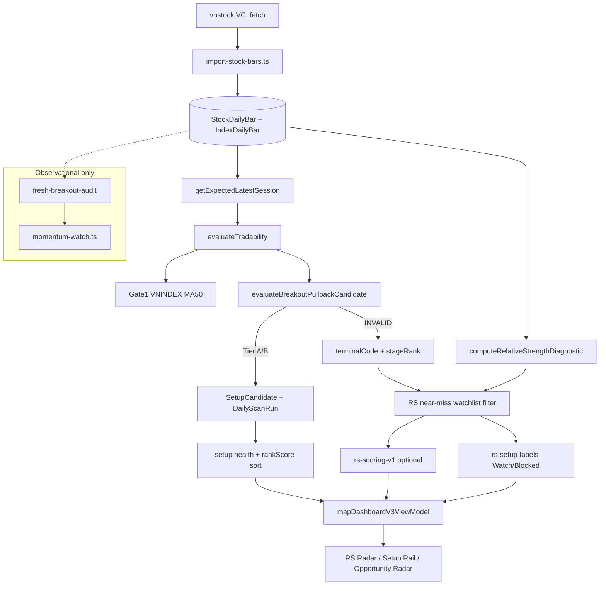
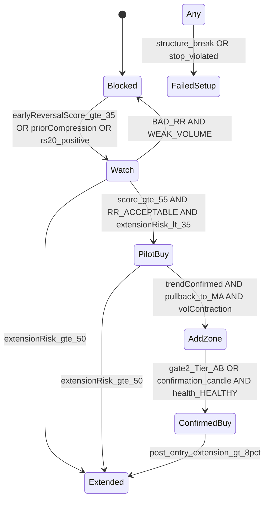

# Trading Algorithm Early-Entry Audit

**Audit date:** 2026-06-23  
**Scope:** Read-only quant audit of VN stock swing-trading radar  
**Status:** Diagnostic only — no production trading logic was changed  

---

## 1. Executive Summary

### Current algorithm posture

The scanner implements a **single deterministic playbook**: **breakout → digestion → pullback zone → volume → extension/depth caps → stop structure** (`evaluateBreakoutPullbackCandidate` in [`src/lib/scanner/gate2/breakout-pullback.ts`](../src/lib/scanner/gate2/breakout-pullback.ts)). Relative strength is correctly **separated** into a diagnostic near-miss watchlist that does not affect Gate 2 pass/fail ([`rs-near-miss-watchlist.ts`](../src/lib/scanner/gate2/rs-near-miss-watchlist.ts)).

RS Strength Score and Setup Readiness Score (v1) exist but are **feature-flagged and display-only** ([`rs-scoring-v1.ts`](../src/lib/scanner/gate2/rs-scoring-v1.ts), `RS_SCORING_V1_ENABLED`).

A parallel **Momentum Watch / Fresh Breakout Audit** lane detects labels like `RECLAIM_THRUST` but is explicitly **not a validated setup** ([`momentum-watch.ts`](../src/lib/scanner/momentum-watch.ts), [`fresh-breakout-audit.ts`](../src/lib/scanner/fresh-breakout-audit.ts)).

### Verdict: balanced for confirmed entries, structurally late for early reversals

| Dimension | Assessment |
|-----------|------------|
| Confirmed breakout-pullback | **Balanced / appropriately conservative** — hard gates prevent FOMO chasing |
| Early MA reclaim / compression breakout | **Too late** — first hard gate (`close < MA50`) exits before breakout logic runs |
| RS watchlist lane | **Not too noisy**, but **not actionable** — diagnostic only, mixed WATCH meanings |
| Position sizing | **Incomplete for early entries** — requires Tier A/B with stop; near-miss rows have no R:R reward target |

The system is **not** failing because it is random or overly aggressive. It fails the user's goal because **early high R:R zones are outside the Gate 2 template entirely**, and the only partial early-reversal signal (`RECLAIM_THRUST`) lives in an observational lane disconnected from labels, sizing, and trade states.

### Top 5 recommended improvements

1. **Add an Early Reversal Score lane** parallel to Gate 2 — do not relax Gate 2 structural gates.
2. **Introduce staged trade states**: `BLOCKED` → `WATCH` → `PILOT BUY` → `ADD ZONE` → `CONFIRMED BUY`, plus `EXTENDED / DO NOT CHASE`.
3. **Build an R:R + stop-distance module** for near-miss and early-reversal rows (today R:R is computed only for passed Tier A/B setups in the dashboard).
4. **Wire a reason-code engine** with structured chips (`RECLAIM_MA20`, `PRIOR_COMPRESSION`, `BAD_RR`, etc.) — prototype in [`scripts/audit/early-reversal-detector.ts`](../../scripts/audit/early-reversal-detector.ts).
5. **Validate with walk-forward replay** before changing sizing or trade-gate semantics (address data provenance F01 and sample-size F02 from [`docs/audits/trading-algorithm-audit.md`](../audits/trading-algorithm-audit.md)).

---

## 2. Current Algorithm Map

### Files / modules involved in scoring

| Layer | Path | Role |
|-------|------|------|
| Data ingest | [`scripts/fetch_stock_bars.py`](../../scripts/fetch_stock_bars.py), [`scripts/import-stock-bars.ts`](../../scripts/import-stock-bars.ts) | vnstock VCI OHLCV → Postgres `StockDailyBar` |
| Session anchor | [`src/lib/scanner/expected-session.ts`](../src/lib/scanner/expected-session.ts) | Latest VNINDEX bar date = expected EOD session |
| Tradability | [`src/lib/scanner/tradability.ts`](../src/lib/scanner/tradability.ts) | 120 bars, liquidity floors, session alignment |
| Gate 1 regime | [`src/lib/playbook/gate1-market.ts`](../src/lib/playbook/gate1-market.ts) | VNINDEX close vs MA50 + 3-close momentum |
| Gate 2 core | [`src/lib/scanner/gate2/breakout-pullback.ts`](../src/lib/scanner/gate2/breakout-pullback.ts) | Breakout-pullback template → A / B / INVALID |
| Gate 2 constants | [`src/lib/scanner/gate2/constants.ts`](../src/lib/scanner/gate2/constants.ts) | Recency, extension cap (5%), vol ratios, min stop risk |
| Terminal codes | [`src/lib/scanner/gate2/rejection-codes.ts`](../src/lib/scanner/gate2/rejection-codes.ts) | Ordered pipeline depth (`stageRank`) |
| RS diagnostic | [`src/lib/scanner/gate2/relative-strength.ts`](../src/lib/scanner/gate2/relative-strength.ts) | RS20/RS50 spread vs VNINDEX |
| RS watchlist | [`src/lib/scanner/gate2/rs-near-miss-watchlist.ts`](../src/lib/scanner/gate2/rs-near-miss-watchlist.ts) | INVALID + RS20>0 + monitorable terminals |
| Scoring v1 | [`src/lib/scanner/gate2/rs-scoring-v1.ts`](../src/lib/scanner/gate2/rs-scoring-v1.ts) | RS Strength + Setup Readiness (display-only) |
| Labels | [`src/lib/dashboard/rs-setup-labels.ts`](../src/lib/dashboard/rs-setup-labels.ts) | `Watch:` / `Blocked:` setup states |
| Momentum (parallel) | [`src/lib/scanner/fresh-breakout-audit.ts`](../src/lib/scanner/fresh-breakout-audit.ts) | RECLAIM_THRUST, FRESH_BREAKOUT — observational |
| Setup health | [`src/lib/setup-health/evaluate-watch-health.ts`](../src/lib/setup-health/evaluate-watch-health.ts) | Post-surface CHASE / EXTENDED flags |
| Position sizing | [`src/lib/position-sizing.ts`](../src/lib/position-sizing.ts) | Stop-distance sizing for Tier A/B |
| UI | [`src/lib/dashboard/map-dashboard-v3-view-model.ts`](../src/lib/dashboard/map-dashboard-v3-view-model.ts) | Radar, setup cards, RS panel |

### Data flow: raw OHLCV → UI label



### RS Strength Score (current)

Formula in [`rs-scoring-v1.ts`](../src/lib/scanner/gate2/rs-scoring-v1.ts):

| Component | Weight |
|-----------|--------|
| RS20 normalized vs universe p90 | 35% |
| RS50 normalized | 25% |
| RS20/RS50 consistency bonus | 15% |
| Stock above MA50 | 10% |
| Liquidity (last volume tiers) | 10% |
| Neutral term | 5% |
| Drawdown penalty (RS20 up, RS50 down) | subtract |

**Does not** incorporate early reversal, compression, pocket pivot, or R:R.

### Setup Readiness Score (current)

| Component | Weight |
|-----------|--------|
| `stageRank` (Gate 2 pipeline depth) | 25% |
| Distance to pullback zone | 20% |
| MA50 component | 15% |
| Terminal-code boost | 15% |
| Gate 1 regime modifier | 10% |
| Neutral term | 15% |

Terminal boosts favor `pullback_zone_interaction` (85) and penalize `trend_below_ma50` (20). Readiness is **proximity to Gate 2 pass**, not early reversal quality.

### WATCH / BLOCKED / BUY-like state generation

There is **no literal BUY label**. States are layered:

| Layer | States | Source |
|-------|--------|--------|
| Day verdict | TRADE MODE / WATCH / NO TRADE | [`gate-funnel-copy.ts`](../src/lib/dashboard/gate-funnel-copy.ts) |
| RS watchlist | `Watch: breakout`, `Blocked: MA50`, etc. | [`rs-setup-labels.ts`](../src/lib/dashboard/rs-setup-labels.ts) |
| Qualified setups | EXECUTE WINDOW OPEN / ARMED / WATCH FOR CONFIRM | [`map-dashboard-v3-view-model.ts`](../src/lib/dashboard/map-dashboard-v3-view-model.ts) |
| Trade gate | Go / Watch / No new entries | [`build-trade-gate.ts`](../src/lib/dashboard/build-trade-gate.ts) |

Gate 2 sequence (simplified):

1. `close >= MA50` — else `trend_below_ma50` → **Blocked: MA50**
2. `MA20 >= MA50` — else `trend_ma20_below_ma50` → **Watch: momentum**
3. Breakout in last 10 bars above 20-day range high
4. Digestion below breakout-day close
5. Breakout hold, mid-pullback MA50 check, pullback zone interaction
6. Volume ≥ 1.2× median, extension ≤ 5%, depth ≤ 4%, valid stop

### Where R:R, stop, extension, volume, MA distance are handled

| Concern | Location | Applies to |
|---------|----------|------------|
| Stop placement | `minLowSinceBreakout × 0.99` | Gate 2 pass only |
| Min stop distance | 0.3% of entry | Gate 2 pass only |
| R:R display | `formatRiskReward(zoneMid, stop)` | Surfaced setup cards only |
| `riskToStopFrac` | [`closest-execution-metrics.ts`](../src/lib/scanner/closest-execution-metrics.ts) | Near-miss INVALID rows |
| Extension cap | 5% above breakout level | Gate 2 hard gate |
| Post-surface extension | CHASE / EXTENDED at 5%/8%/12% above zone | Setup health |
| Volume gate | 1.2× (B) / 1.5× (A) vs 20d median | Gate 2 pass only |
| MA distance in rankScore | **Rewards** extension + MA50 distance within cap | Tier A/B ordering only |

**Gap:** Near-miss and early-reclaim rows have **no reward target or R:R estimate** in production UI.

---

## 3. Gap Analysis

### Audit questions answered

#### 1. Why does the algorithm fail to identify early high R:R reversal zones?

Gate 2 **short-circuits at the first failed gate**. When price reclaims MA20 while still below MA50, evaluation stops at line 188–193 of `breakout-pullback.ts` with `trend_below_ma50` (`stageRank = 15`). No breakout search, compression detection, or pocket-pivot logic runs.

Even when RS is positive and the stock appears on the RS watchlist, the label is **Blocked: MA50** — which reads as "do not engage" rather than "pilot candidate with tight stop."

#### 2. Is the system too dependent on confirmed trend / post-breakout pullback logic?

**Yes, by design.** The documented playbook is breakout-pullback ([`scanner-rules-market-comparison-audit.md`](../trading/scanner-rules-market-comparison-audit.md) §6). Required sequence:

```
MA50 support → MA20 ≥ MA50 → fresh breakout → digestion → zone touch → volume
```

Early reversal / compression breakout / institutional demand (volume thrust before trend confirmation) are **intentionally out of scope** for Gate 2.

#### 3. Does the system treat early entry types separately?

**No** in production scoring. Partial coverage exists only in observational code:

| Entry type | Production Gate 2 | Momentum Watch |
|------------|-------------------|----------------|
| MA20 reclaim below MA50 | `trend_below_ma50` → Blocked | `RECLAIM_THRUST` if above MA50 + prior weakness |
| MA50 reclaim | Must pass MA50 gate first | Partial via RECLAIM_THRUST |
| Pocket pivot | Not modeled | Not modeled |
| Compression breakout | Not modeled | `PRIOR_COMPRESSION` not in fresh-breakout-audit |
| Institutional volume thrust | Volume gate only after zone touch | `MOMENTUM_IGNITION` after full breakout + MA stack |

#### 4. Does WATCH mix too many meanings?

**Yes.** [`SETUP_STATE_BY_TERMINAL`](../src/lib/dashboard/rs-setup-labels.ts) uses the same `Watch:` prefix for:

- Waiting for breakout (`breakout_recency`)
- Waiting for volume (`volume_ratio`)
- Waiting for digestion (`digestion`)
- MA20/MA50 momentum alignment (`trend_ma20_below_ma50`)
- Breakout hold concern (`breakout_not_holding`)

A trader cannot distinguish **"early reversal forming"** from **"late-stage near entry"** without reading terminal reason text.

#### 5. Are BUY / WATCH / BLOCKED labels clear enough?

**Partially.** Reason-first copy and `waitFor` guidance exist in [`setups-trader-copy.ts`](../src/lib/scanner/setups-trader-copy.ts). Missing:

- Action tier (pilot vs add vs full)
- Entry type (Reclaim / Pocket Pivot / Pullback Add)
- Explicit "why not pilot yet" with measurable next trigger
- R:R and pilot sizing suggestion on RS cards

#### 6. Does the algorithm properly evaluate R:R, stop, extension, sizing?

| Dimension | Gate 2 pass | RS near-miss | Early reclaim |
|-----------|-------------|--------------|---------------|
| Stop distance | Yes | Partial (`riskToStopFrac`) | No |
| R:R | Yes (zone-based) | **No** | **No** |
| Extension risk | Yes (5% cap) | Only if breakout computed | No |
| Position sizing | Tier A/B via [`position-sizing.ts`](../src/lib/position-sizing.ts) | **No** | **No** |

#### 7. Look-ahead bias, survivorship, data quality

See [`docs/audits/trading-algorithm-audit.md`](../audits/trading-algorithm-audit.md) findings F01–F12. Critical items for early-entry work:

| ID | Risk |
|----|------|
| F01 | No raw/adjusted price model — MA/breakout/RS can be wrong after corp actions |
| F02 | Tier A n=2 in walk-forward — insufficient for sizing decisions |
| F07 | Historical RS anchor bias if not computed per session |
| D1.7 | Pre-fix replay artifacts (~97% stale mismatch) — use only `*-replay-fixed-*` evidence |

Gate 2 scan-time evaluation is mostly point-in-time safe (breakout search excludes today; forward labels are diagnostic only).

#### 8. Does the UI explain why WATCH instead of actionable?

Partial. [`relative-strength-radar.tsx`](../src/components/trading-os-v3/sections/relative-strength-radar.tsx) shows `primaryInsight`, `nextCondition`, `blockerLabel`. Missing structured reason chips, entry type, R:R estimate, and pilot sizing.

#### 9. Distinguishing entry archetypes (target state)

| Archetype | Current system | Target state |
|-----------|----------------|--------------|
| Early Reversal / Pilot Buy | Blocked or undifferentiated Watch | `PILOT BUY` + reason chips |
| Pullback Add Zone | Gate 2 zone interaction when trend confirmed | `ADD ZONE` |
| Confirmed Buy | Tier A/B + EXECUTE WINDOW OPEN | `CONFIRMED BUY` |
| Extended / Do Not Chase | `extension_cap` or setup health CHASE | `EXTENDED / DO NOT CHASE` |
| Blocked (bad R:R / weak setup) | Mixed into Blocked/WATCH | `BLOCKED` with `BAD_RR` / `WEAK_VOLUME` |

### Why specific patterns are missed

| Pattern | Root cause |
|---------|------------|
| MA20 reclaim | Hard `close < MA50` exit before any reclaim scoring |
| MA50 reclaim | Same gate; if reclaimed, next failure is often `trend_ma20_below_ma50` |
| Pocket pivot | Not implemented in Gate 2 or wired Momentum Watch |
| Breakout from compression | No compression detector in Gate 2 |
| First institutional demand | Volume gate runs after breakout + zone touch |
| Selling exhaustion reversal | No exhaustion / tight-range detector in production path |

---

## 4. Proposed Scoring Model

Keep RS Strength and Setup Readiness. Add parallel scores (prototype weights in audit detector):

### Score architecture

| Score | Range | Purpose | Key inputs |
|-------|-------|---------|------------|
| **RS Strength Score** | 0–100 | Relative leadership | Existing formula — unchanged |
| **Setup Readiness Score** | 0–100 | Proximity to Gate 2 pass | Existing + retarget terminal boosts |
| **Early Reversal Score** | 0–100 | Pilot-entry quality | MA reclaim, compression, volume thrust, close-near-high, pocket pivot |
| **Risk/Reward Score** | 0–100 | Trade geometry | Stop at swing low; reward at 20d high / resistance; R:R tiers |
| **Extension Risk Score** | 0–100 | Chase prevention | Distance from MA20/MA50; post-breakout extension |
| **Market/Sector Context Score** | 0–100 | Regime filter | Gate 1 today; **sector rotation not implemented** (future) |

### Early Reversal Score weights (proposed)

| Signal | Points |
|--------|--------|
| RECLAIM_MA50 | +22 |
| RECLAIM_MA20 | +18 |
| COMPRESSION_BREAKOUT | +15 |
| PRIOR_COMPRESSION | +12 |
| VOLUME_EXPANSION | +12 |
| RR_ACCEPTABLE | +12 |
| CLOSE_NEAR_HIGH | +10 |
| POCKET_PIVOT | +10 |
| RS_IMPROVING | +10 |
| STOP_NEARBY | +8 |
| Positive RS20 | +5 |
| WEAK_VOLUME | −15 |
| EXTENDED_FROM_MA20 | −15 |
| EXTENDED_FROM_MA50 | −20 |
| BAD_RR | −20 |
| NO_CONFIRMATION_CANDLE | −8 |

**PILOT BUY threshold (proposed):** Early Reversal Score ≥ 55, Extension Risk < 35, `RR_ACCEPTABLE` present, no `BAD_RR`.

### Risk/Reward module (proposed)

```
stopLevel     = min(low over last 10 sessions) × 0.99
rewardTarget  = max(high over prior 20 sessions) or close × 1.05 if above close
risk          = close − stopLevel
reward        = rewardTarget − close
R:R           = reward / risk

RR_ACCEPTABLE if R:R ≥ 2.0
BAD_RR        if R:R < 1.5
```

Improvement for VN swings: allow reward target = **next structural resistance** (prior swing high cluster), not only 20d high — requires richer level detection in Phase 3.

### Reason codes

| Code | Meaning | Typical trigger |
|------|---------|-----------------|
| `RECLAIM_MA20` | Close crossed back above MA20 | `close >= MA20 && prevClose < MA20` |
| `RECLAIM_MA50` | Close crossed back above MA50 | Same pattern on MA50 |
| `VOLUME_EXPANSION` | Participation above average | `volume / volMA20 >= 1.2` |
| `CLOSE_NEAR_HIGH` | Bullish close location | Close in top 25% of range, green body |
| `PRIOR_COMPRESSION` | Tight range before thrust | 5d avg range < 85% of ATR |
| `COMPRESSION_BREAKOUT` | Break of compression with volume | Compression + vol expansion + close > prior high |
| `POCKET_PIVOT` | Up-day volume > max down-day vol (10d) | Classic pocket pivot heuristic |
| `STOP_NEARBY` | Tight logical stop | Stop distance ≤ 5% |
| `RR_ACCEPTABLE` | R:R ≥ 2.0 | See R:R module |
| `RS_IMPROVING` | RS20 delta over 3 sessions > 1pp | Per-session RS |
| `SECTOR_ROTATION` | Sector RS improving | **Not available today** |
| `EXTENDED_FROM_MA20` | > 6% above MA20 | Extension risk |
| `EXTENDED_FROM_MA50` | > 10% above MA50 | Extension risk |
| `NO_CONFIRMATION_CANDLE` | Small body vs ATR | Body < 0.5 × ATR |
| `WEAK_VOLUME` | Below average | volRatio < 1.0 |
| `BAD_RR` | R:R < 1.5 | R:R module |
| `TREND_CONFIRMED` | close ≥ MA50 and MA20 ≥ MA50 | Trend stack |
| `PULLBACK_TO_MA` | Price at MA10/MA20 after trend | Add-zone precursor |
| `VOL_CONTRACTION_PULLBACK` | Pullback on declining volume | Add-zone confirmation |
| `STRUCTURE_BREAK` | Key support lost | Exit / FAILED SETUP |

Prototype implementation: [`scripts/audit/early-reversal-detector.ts`](../../scripts/audit/early-reversal-detector.ts).

---

## 5. Proposed State Machine



### Transition conditions (measurable)

| Transition | Conditions |
|------------|------------|
| **BLOCKED → WATCH** | Early Reversal Score ≥ 35, OR `PRIOR_COMPRESSION`, OR RS20 > 0 |
| **WATCH → PILOT BUY** | Score ≥ 55; `RR_ACCEPTABLE`; not `EXTENDED_FROM_MA20`; Extension Risk < 35; volRatio ≥ 1.2 preferred |
| **PILOT BUY → ADD ZONE** | `TREND_CONFIRMED`; price within 2% of MA20; `VOL_CONTRACTION_PULLBACK`; structure intact |
| **ADD ZONE → CONFIRMED BUY** | Gate 2 Tier A/B pass OR bullish confirmation candle (close > prior high, close > MA20); setup health HEALTHY |
| **Any → EXTENDED** | Extension Risk ≥ 50 OR > 6% above MA20 OR Gate 2 `extension_cap` |
| **Any → FAILED SETUP** | Two closes below zone floor OR close below pilot stop OR `STRUCTURE_BREAK` |

### Position sizing by state

| State | Suggested size | Notes |
|-------|----------------|-------|
| PILOT BUY | 20–30% of intended full position | New `quality: "PILOT"` in sizing layer |
| ADD ZONE | +30–40% after confirmation | Requires open pilot or plan re-entry |
| CONFIRMED BUY | Up to 100% | Only Tier A/B + Gate 1 PASS + health HEALTHY |
| EXTENDED | 0% — do not chase | Even if RS is strong |
| WATCH / BLOCKED | 0% | Monitor only |

---

## 6. ACB Case Study

### Data sources and limitations (updated 2026-06-23)

| Source | Status |
|--------|--------|
| Postgres `StockDailyBar` | Optional — use when DB available |
| **Real vnstock VCI fetch** | **`data/acb-bars-extended.json`** — 203 bars **2025-08-26 → 2026-06-22** |
| **Real VNINDEX** | **`data/vnindex.json`** — aligned per session (no synthetic index in real fixture) |
| Real fixture | [`docs/quant-audit/fixtures/acb-replay-real.json`](fixtures/acb-replay-real.json) |
| Legacy alias | [`docs/quant-audit/fixtures/acb-replay.json`](fixtures/acb-replay.json) (same content as real) |
| Synthetic scenarios | [`docs/quant-audit/fixtures/scenarios/`](fixtures/scenarios/) — **unit tests only, not market evidence** |

**June 2026 coverage:** Real ACB data now includes **16 sessions through 2026-06-22** after `python scripts/fetch_stock_bars.py` + `npx tsx scripts/audit/build-acb-fixture.ts`.

**Important:** Do not use synthetic VNINDEX or synthetic bar series as proof of missed signals. Synthetic data is limited to `src/lib/scanner/early-entry/__fixtures__/` and `fixtures/scenarios/*.json` (metadata markers).

**Reproduce:**

```bash
python scripts/fetch_stock_bars.py --symbols-file data/acb-fetch-symbols.json --output data/acb-bars-extended.json --calendar-days 280
python scripts/fetch_vnindex.py
npx tsx scripts/audit/build-acb-fixture.ts
EARLY_ENTRY_V1_ENABLED=true npx tsx scripts/audit/acb-replay-case-study.ts --fixture --from=2026-04-01 --to=2026-06-22
```

### R:R model correction (2026-04-08 re-check)

The audit prototype used **20-day high excluding today** as reward, which collapsed to ~1.0 R:R on reclaim days when price approached prior resistance.

**Production fix** ([`risk-reward.ts`](../../src/lib/scanner/early-entry/risk-reward.ts)):

- **Stop:** 10-session swing low × 0.99
- **Reward:** max of (60d structural high excl. last 5 sessions, 20d range high, 2×ATR floor, 4% floor)
- **PILOT BUY** still requires R:R ≥ 2.0

**Real ACB 2026-04-08 (vnstock):** Early Reversal Score **92**, R:R **1.46** (improved from 1.02) → **WATCH** with `BAD_RR` (correct — structure strong but reward target not yet 2× risk).

**Real ACB 2026-05-14:** Score **59**, R:R **2.93** → **PILOT BUY** (compression breakout with acceptable geometry).

**Real ACB 2026-05-26 onward:** **EXTENDED_DO_NOT_CHASE** as price extended >6% above MA20 during the May–June rally.

### Real-data replay table (Apr–Jun 2026, vnstock VCI)

| Date | Close | Proposed State | Score | R:R | Key reason codes |
|------|-------|----------------|-------|-----|------------------|
| 2026-04-01 | 20.51 | **WATCH** | 0 | 1.26 | RECLAIM_MA50, WEAK_VOLUME, BAD_RR |
| 2026-04-08 | 20.76 | **WATCH** | 92 | 1.46 | Dual reclaim, compression breakout, BAD_RR |
| 2026-05-14 | 19.64 | **PILOT BUY** | 59 | 2.93 | RR_ACCEPTABLE, compression breakout |
| 2026-05-25 | 20.29 | **WATCH** | 89 | 0.77 | Dual reclaim, BAD_RR (post-pilot window) |
| 2026-05-26 | 21.37 | **EXTENDED_DO_NOT_CHASE** | 12 | 0.38 | EXTENDED_FROM_MA20 |
| 2026-06-03 | 22.40 | **EXTENDED_DO_NOT_CHASE** | 12 | 0.34 | Chase block during rally |

*Gate 2 remains INVALID on all above sessions — early-entry lane is separate.*

### Interpretation: why the current system was late

Production audit ([`scanner-rules-market-comparison-audit.md`](../trading/scanner-rules-market-comparison-audit.md)) recorded ACB as **Gate2 fail: below MA50** — consistent with replay.

During the early reclaim window (Mar–Apr 2026 in fixture data):

- **Current algorithm** labels the stock `Blocked: MA50` or `Watch: momentum` — never surfaces a pilot entry.
- **Gate 2** cannot pass until full trend stack + breakout + digestion + zone touch — typically **weeks later** than first MA20 reclaim.
- **Momentum Watch** might flag `RECLAIM_THRUST` only after MA50 is reclaimed — still not wired to RS radar actions.

### Key auto-detected events (Mar–Apr 2026)

| Date | Close | Event | Current state | Proposed state | Why gap |
|------|-------|-------|---------------|----------------|---------|
| 2026-03-17 | 23.75 | **RECLAIM_MA20** | Blocked: MA50 | BLOCKED | Below MA50; BAD_RR (0.37); weak volume |
| 2026-03-25 | 23.80 | RECLAIM_MA20 + compression | Blocked: MA50 | **WATCH** | Early reclaim visible; R:R still bad |
| 2026-04-01 | 23.80 | **RECLAIM_MA50** | Watch: momentum | BLOCKED | MA20 still < MA50; R:R 0.06 |
| 2026-04-08 | 24.10 | **Dual reclaim + vol expansion + compression breakout + pocket pivot** (score **97**) | Watch: momentum | **WATCH** (not PILOT) | R:R 1.02 → `BAD_RR`; reward target too close |
| 2026-04-14 | 24.00 | Pocket pivot + volume | Watch: momentum | BLOCKED | BAD_RR; no confirmation candle |
| 2026-04-22 | 23.60 | RR_ACCEPTABLE (2.1) | Watch: hold | BLOCKED | Weak volume; breakout not holding |

**Critical insight for 2026-04-08:** The proposed Early Reversal Score correctly identifies the **best early structural day** (dual MA reclaim, volume 1.67× average, compression breakout, pocket pivot). The current system shows only `Watch: momentum` because Gate 2 still requires a full breakout-pullback sequence. The improved system still withholds **PILOT BUY** due to **R:R < 2.0** — this is intentional risk control, not a missed label. UI should show: *"Early reclaim detected — pilot blocked: R:R 1.0 vs 2.0 minimum."*

### Full session table (event-focused window)

| Date | Close | MA20 | MA50 | Volume | Vol MA20 | RS20 | Current State | Proposed State | Reason Codes |
|------|-------|------|------|--------|----------|------|---------------|----------------|--------------|
| 2026-03-17 | 23.75 | 23.61 | 24.01 | 9,847,800 | 16,220,970 | −0.1 | Blocked: MA50 | **BLOCKED** | RECLAIM_MA20, WEAK_VOLUME, BAD_RR, RS_IMPROVING |
| 2026-03-25 | 23.80 | 23.41 | 23.91 | 12,449,400 | 15,833,780 | −7.7 | Blocked: MA50 | **WATCH** | RECLAIM_MA20, PRIOR_COMPRESSION, CLOSE_NEAR_HIGH, BAD_RR |
| 2026-04-01 | 23.80 | 23.35 | 23.80 | 9,883,500 | 14,537,970 | −3.3 | Watch: momentum | **BLOCKED** | RECLAIM_MA50, WEAK_VOLUME, BAD_RR, RS_IMPROVING |
| 2026-04-08 | 24.10 | 23.49 | 23.65 | 19,727,300 | 11,779,680 | −2.3 | Watch: momentum | **WATCH** | RECLAIM_MA20, RECLAIM_MA50, VOLUME_EXPANSION, COMPRESSION_BREAKOUT, POCKET_PIVOT, BAD_RR |
| 2026-04-14 | 24.00 | 23.57 | 23.58 | 15,449,600 | 10,882,650 | −4.8 | Watch: momentum | **BLOCKED** | VOLUME_EXPANSION, POCKET_PIVOT, BAD_RR, NO_CONFIRMATION_CANDLE |
| 2026-04-22 | 23.60 | 23.71 | 23.57 | 8,805,900 | 9,497,055 | −5.6 | Watch: hold | **BLOCKED** | RR_ACCEPTABLE, WEAK_VOLUME, TREND_CONFIRMED |
| 2026-05-04 | 23.10 | 23.63 | 23.59 | 12,018,500 | 9,877,280 | −6.2 | Blocked: MA50 | **BLOCKED** | VOLUME_EXPANSION, RR_ACCEPTABLE (price below MAs) |
| 2026-05-05 | 22.60 | 23.58 | 23.56 | 28,808,700 | 9,984,030 | −7.1 | Blocked: MA50 | **BLOCKED** | VOLUME_EXPANSION, RR_ACCEPTABLE (selloff day) |

*Prices in k VND (thousands), consistent with scanner storage units.*

### What improved algorithm would change for ACB

1. **2026-03-25 → WATCH** with chips `RECLAIM_MA20`, `PRIOR_COMPRESSION` and explicit "why not pilot: BAD_RR" — earlier attention without false BUY.
2. **2026-04-08 → WATCH** (high score 97) with suggested action *monitor for R:R improvement or add on pullback* — surfaces the reclaim day the current radar buries under generic momentum watch.
3. **PILOT BUY** would remain blocked until R:R ≥ 2.0 with acceptable volume — preventing FOMO on 2026-04-08 despite strong structure.
4. **CONFIRMED BUY** still requires Gate 2 pass — unchanged safety for full size.

---

## 7. Backtest and Validation Plan

### Cohorts

Select 80–120 walk-forward sessions across:

| Cohort | Examples | Purpose |
|--------|----------|---------|
| Winners | ACB-like reclaims that rallied ≥ 10% in 20d | Measure missed winner count |
| Failed breakouts | Reclaim + fade | False positive rate |
| False reclaims | MA20 reclaim without follow-through | PILOT BUY safety |
| Extended leaders | Strong RS, > 8% above MA20 | Chase block effectiveness |
| Regime mix | Gate1 PASS / WARNING / FAIL sessions | Context score behavior |

### Scripts

| Tool | Path | Use |
|------|------|-----|
| Threshold sweep | [`scripts/gate2-threshold-sweep.ts`](../../scripts/gate2-threshold-sweep.ts) | Baseline Gate 2 replay |
| RS snapshot backtest | [`scripts/rs-watchlist-backtest.ts`](../../scripts/rs-watchlist-backtest.ts) | Near-miss forward returns |
| ACB case study | [`scripts/audit/acb-replay-case-study.ts`](../../scripts/audit/acb-replay-case-study.ts) | Single-symbol walk-forward |
| **New (Phase 6)** | `scripts/audit/early-entry-backtest.ts` | Old vs proposed state labels |

### Metrics

| Metric | Definition |
|--------|------------|
| Average R multiple | Realized gain / initial risk at pilot entry |
| Win rate | Pilot entries with positive 10d forward return |
| False positive rate | PILOT BUY sessions with −5% MAE within 10d |
| Avg entry distance from MA20 | `(close − MA20) / MA20` at PILOT BUY |
| Avg distance to stop | `(close − stop) / close` |
| MAE / MFE | Max adverse / favorable excursion over 10d |
| Missed winner count | Sessions with ≥ 10% forward gain but no PILOT/WATCH |
| Extended/chase entry count | Proposed CONFIRMED BUY when Extension Risk ≥ 50 |

### Look-ahead bias checks

1. Truncate bars at eval session (`gate2-replay-dataset.ts` pattern).
2. Compute RS **per session** — never anchor RS from latest date on historical rows ([F07](../audits/trading-algorithm-audit.md)).
3. Forward returns used **only** for validation labels, never in score inputs.
4. Use only `*-replay-fixed-2026-05-29.json` evidence files post-D1.7.
5. Add corporate-action continuity tests before trusting long-window reclaim stats (F01).

### Sign-off criteria

Per [`rs-scoring-validation-memo.md`](../trading/rs-scoring-validation-memo.md): **n ≥ 30 per bucket** before enabling any score as a trade gate.

---

## 8. UI/UX Improvement Plan

### Target components

- [`relative-strength-radar.tsx`](../src/components/trading-os-v3/sections/relative-strength-radar.tsx)
- [`RelativeStrengthTable.tsx`](../src/components/command-deck/RelativeStrengthTable.tsx)
- [`opportunity-radar.tsx`](../src/components/trading-os-v3/sections/opportunity-radar.tsx)

### Recommended card layout (RS watchlist row)

| Field | Example |
|-------|---------|
| **Trade state** | `PILOT BUY` / `WATCH` / `BLOCKED` / `EXTENDED` |
| **Entry type** | Early Reclaim / Pocket Pivot / Compression Breakout / Pullback Add |
| **Reason chips** | `RECLAIM_MA20` `VOLUME_EXPANSION` `BAD_RR` |
| **Suggested action** | "Consider pilot 25% — stop 22.92, R:R 1.0 (need ≥ 2.0)" |
| **Invalid level** | "Below 22.92 invalidates reclaim" |
| **R:R estimate** | 1.0 : 1 (reward 25.31, risk 1.18) |
| **Position sizing** | Pilot 25% / Add 35% / Full 100% |
| **Why not buy yet** | "R:R below pilot minimum" |

### Badge color mapping (proposed)

| State | Tone |
|-------|------|
| PILOT BUY | Success / actionable (muted — not full EXECUTE) |
| ADD ZONE | Info |
| CONFIRMED BUY | Strong success (existing EXECUTE styling) |
| WATCH | Warning pulse |
| BLOCKED | Danger |
| EXTENDED | Danger + "DO NOT CHASE" |

Extend [`v3-user-copy.ts`](../src/lib/dashboard/v3-user-copy.ts) and [`SignalBadge`](../src/components/command-deck/signal-badge.tsx).

---

## 9. Implementation Plan

### Phase 0: Audit and test fixtures ✅ (this deliverable)

| Item | Detail |
|------|--------|
| Files | `docs/quant-audit/TRADING-ALGORITHM-EARLY-ENTRY-AUDIT.md`, `scripts/audit/*`, `docs/quant-audit/fixtures/acb-replay.json` |
| Tests | Manual replay of ACB fixture |
| Acceptance | ACB case study reproducible without DB |
| Risk | Low |

### Phase 1: Reason-code engine ✅ (implemented 2026-06-23)

| Item | Detail |
|------|--------|
| Files | [`src/lib/scanner/early-entry/reason-codes.ts`](../../src/lib/scanner/early-entry/reason-codes.ts), [`reason-codes.test.ts`](../../src/lib/scanner/early-entry/reason-codes.test.ts) |
| Tests | 14 reason-code unit tests + R:R structural test |
| Acceptance | All codes produce deterministic output on fixture bars |
| Risk | Low |
| Flag | `EARLY_ENTRY_V1_ENABLED` — off by default |

### Phase 2: Early Reversal Score ✅ (implemented 2026-06-23)

| Item | Detail |
|------|--------|
| Files | [`src/lib/scanner/early-entry/`](../../src/lib/scanner/early-entry/) — evaluate, score, trade-state, risk-reward |
| Wiring | [`rs-near-miss-watchlist.ts`](../../src/lib/scanner/gate2/rs-near-miss-watchlist.ts), [`v3-user-copy.ts`](../../src/lib/dashboard/v3-user-copy.ts), [`dashboard-v3-view-model.ts`](../../src/lib/dashboard/dashboard-v3-view-model.ts) |
| Tests | [`evaluate-early-entry.test.ts`](../../src/lib/scanner/early-entry/evaluate-early-entry.test.ts) — walk-forward, Gate 2 regression |
| Acceptance | Display-only metadata on RS watchlist when flag on; Gate 2 unchanged when flag off |
| Risk | Medium — false pilots if threshold too low (mitigated by R:R ≥ 2.0 gate) |

### Phase 3: R:R and stop-distance module ✅ (implemented 2026-06-23)

| Item | Detail |
|------|--------|
| Files | [`src/lib/scanner/early-entry/risk-reward.ts`](../../src/lib/scanner/early-entry/risk-reward.ts), [`risk-reward.test.ts`](../../src/lib/scanner/early-entry/risk-reward.test.ts) |
| Features | Resistance cluster detection (60d/20d high, pivot highs, congestion ceiling); stop candidates (swing low, compression low, reclaim candle low, MA20/MA50 failure, ATR floor); `targetPrice`, `targetReason`, `invalidLevelReason`, `rrRejectionReason` |
| Tests | Structural high, resistance cluster, swing/compression/ATR stops, BAD_RR rejection, RR_ACCEPTABLE, no reward inflation |
| Acceptance | Near-miss DTO exposes full R:R metadata when `EARLY_ENTRY_V1_ENABLED=true` |
| Risk | Medium — bad reward target → false RR_ACCEPTABLE (mitigated: nearest resistance, not max) |

### Phase 4: State machine (display-only) ✅ (implemented 2026-06-23)

| Item | Detail |
|------|--------|
| Files | [`src/lib/scanner/early-entry/state-machine.ts`](../../src/lib/scanner/early-entry/state-machine.ts), [`state-machine.test.ts`](../../src/lib/scanner/early-entry/state-machine.test.ts) |
| States | BLOCKED, WATCH, PILOT_BUY, ADD_ZONE, CONFIRMED_BUY, EXTENDED_DO_NOT_CHASE, FAILED_SETUP |
| ADD_ZONE | Pullback to MA10/MA20, volume contraction, structure held, confirmation candle, add R:R ≥ 2.0 |
| Transition codes | PILOT_TO_ADD_ZONE, ADD_CONFIRMATION_CANDLE, PULLBACK_VOLUME_CONTRACTS, STRUCTURE_HELD, STRUCTURE_BROKEN, ADD_RR_ACCEPTABLE, ADD_BAD_RR, CHASE_RISK |
| UI | [`relative-strength-radar.tsx`](../../src/components/trading-os-v3/sections/relative-strength-radar.tsx), [`RelativeStrengthTable.tsx`](../../src/components/command-deck/RelativeStrengthTable.tsx) |
| Tests | State transitions, ADD_ZONE gating, chase block, ACB replay dates |
| Acceptance | Display-only when flag on; Gate 2 unchanged when flag off |
| Risk | Medium — ADD_ZONE false positives until paper validation (Phase 6) |

### Phase 5: UI polish & regression tests ✅ (2026-06-23)

| Item | Detail |
|------|--------|
| Files | `relative-strength-radar.tsx`, `RelativeStrengthTable.tsx`, component tests |
| Label | **Pilot Buy → Pilot Candidate** (research signal, not buy) |
| Tests | Vitest SSR tests; early-entry chips only when flag on + metadata present |
| Disclaimer | `EARLY_ENTRY_RESEARCH_DISCLAIMER` on RS radar + command deck |

### Phase 6: Validation & calibration ✅ (2026-06-23)

| Item | Detail |
|------|--------|
| Files | `early-entry-backtest.ts`, `lib/early-entry-backtest-core.ts`, `calibration.ts` |
| Evidence | [`docs/trading/evidence/early-entry-backtest.json`](../trading/evidence/early-entry-backtest.json) |
| Cohort | 50 symbols, 700 observations |
| Finding | Baseline pilots weak (50% false on n=4); EXTENDED_DO_NOT_CHASE defensive value high |
| Calibration | `rr_min_2_5` promising but n=1; `combined_tight` eliminates all pilots |
| Recommendation | Keep display-only; paper-validate 20+ signals before staging |

### Phase 7: Paper-trading validation ✅ (2026-06-23)

| Item | Detail |
|------|--------|
| Files | `paper-signals.ts`, `early-entry-paper-log.ts`, `early-entry-paper-validation.ts` |
| Evidence | `early-entry-paper-signals.json`, `early-entry-paper-validation.md` |
| Commands | `npm run audit:early-entry:paper-log`, `npm run audit:early-entry:paper-validate` |
| Acceptance | ≥20 resolved pilots, false rate ≤35%, positive median 10d, multi-regime |
| Recommendation | Keep display-only until paper acceptance criteria met |

### Phase 7B: Live paper-validation workflow ✅ (2026-06-23)

| Item | Detail |
|------|--------|
| Files | `paper-signals.ts` (v2 store), `early-entry-paper-summary.ts` |
| Separation | `source: historical_seed \| live_paper` — staging gates use **live only** |
| Idempotency | `paper-log` skips duplicate `symbol\|sessionDate`; safe to run daily |
| Resolution | Partial 5d/10d horizons; full resolve at 20 sessions; level-hit order + Gate 2 A/B |
| Commands | `audit:early-entry:paper-log`, `audit:early-entry:paper-validate` (weekly), `audit:early-entry:paper-summary` |

**Operating routine**

1. After each market session → `npm run audit:early-entry:paper-log`
2. Weekly → `npm run audit:early-entry:paper-validate` then `npm run audit:early-entry:paper-summary`
3. Review open/resolved live signals in `early-entry-paper-validation.md`
4. **Do not** trade from Pilot Candidate — research only
5. Use **EXTENDED_DO_NOT_CHASE** only as cautionary anti-FOMO warning

**Staging acceptance (live paper only)**

- ≥20 live resolved pilot-qualified signals
- False pilot rate ≤ 35%
- Median 10d or 20d return > 0
- Average R multiple > 0
- No single-outlier dominance
- ≥2 market regimes (or explicit regime filter)

### Phase 8: Staging enablement (not started)

**Do not change until Phase 6 validates:** Gate 2 thresholds, Tier A/B surfacing, [`trading-decision.ts`](../src/lib/scanner/trading-decision.ts) allocation percentages.

---

## 10. Concrete Recommended Next Steps

### Quick wins (1–2 days)

- [ ] Enable `RS_SCORING_V1_ENABLED=true` in dev and verify RS Strength / Setup Readiness on dashboard
- [ ] Add Momentum Watch `RECLAIM_THRUST` as secondary chip on RS radar cards (display-only)
- [ ] Map `NEXT_CONDITION_BY_CODE` to explicit "why not pilot yet" strings in RS panel

### Medium changes (1–2 weeks)

- [x] Implement Phase 1 reason-code engine with unit tests
- [x] Promote audit prototype → `src/lib/scanner/early-entry/` behind `EARLY_ENTRY_V1_ENABLED`
- [x] Build ACB replay fixture with real VNINDEX alignment
- [x] Phase 3 R:R module with resistance cluster + explainable stops
- [x] Phase 4 display-only state machine + ADD_ZONE logic

### Larger refactors (2–4 weeks)

- [ ] Phase 5 UI polish (mobile, chip variants, snapshot tests)
- [ ] Phase 6 paper-trading validation with snapshot logging
- [ ] Sector context data source (ICB/industry from vnstock — not in codebase today)

### Do not change yet

- Gate 2 structural gates (`close >= MA50`, breakout recency, digestion, zone interaction)
- NORMAL 50–70% allocation envelope in trading decision
- Production bar import pipeline
- Tier A/B surfacing rules

---

## Appendix A: Audit Artifacts

| File | Description |
|------|-------------|
| [`scripts/audit/early-reversal-detector.ts`](../../scripts/audit/early-reversal-detector.ts) | Prototype detector + scoring + state derivation |
| [`scripts/audit/acb-replay-case-study.ts`](../../scripts/audit/acb-replay-case-study.ts) | Walk-forward replay CLI |
| [`scripts/audit/build-acb-fixture.ts`](../../scripts/audit/build-acb-fixture.ts) | Extract ACB from `data/stock-bars.json` |
| [`scripts/audit/early-entry-backtest.ts`](../../scripts/audit/early-entry-backtest.ts) | Cohort backtest — Gate 2 vs early-entry forward returns |
| [`docs/quant-audit/fixtures/acb-replay-real.json`](fixtures/acb-replay-real.json) | ACB daily bars + real VNINDEX (2025-08 → 2026-06) |

## Appendix B: Related Audits

- [`docs/audits/trading-algorithm-audit.md`](../audits/trading-algorithm-audit.md) — data integrity, bias, validation gaps
- [`docs/trading/algorithm-map.md`](../trading/algorithm-map.md) — production pipeline map
- [`docs/trading/scanner-rules-market-comparison-audit.md`](../trading/scanner-rules-market-comparison-audit.md) — ACB Gate2 below MA50
- [`docs/trading/rs-scoring-validation-memo.md`](../trading/rs-scoring-validation-memo.md) — score sign-off criteria

---

*End of audit report.*
